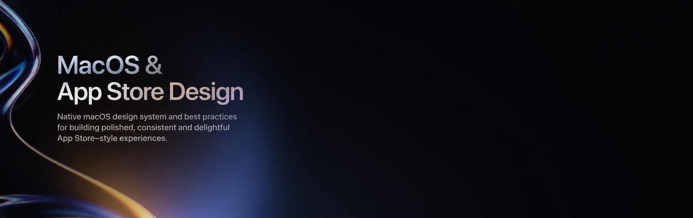

# Apple Design System

  

A collection of CSS spec dumps for Apple's macOS design system components —
auto-layout definitions, dimensions, colors, and states for the core UI controls.

## Contents

- [Alerts](Alerts.css)
- [Boxes](Boxes.css)
- [Buttons](Buttons.css)
- [Color Wells](Color%20Wells.css)
- [Colors](Colors.css)
- [Combo Boxes](Combo%20Boxes.css)
- [Dialogs](Dialogs.css)
- [Disclosure Controls](Disclosure%20Controls.css)
- [Examples](Examples.css)
- [Forms](Forms.css)
- [Lists and Tables](Lists%20and%20Tables.css)
- [Materials](Materials.css)
- [Menu Bar and Dock](Menu%20Bar%20and%20Dock.css)
- [Menus](Menus.css)
- [Notifications](Notifications.css)
- [Pointers](Pointers.css)
- [Pop-up and Pull-down Buttons](Pop-up%20and%20Pull-down%20Buttons.css)
- [Popovers](Popovers.css)
- [Progress Indicators](Progress%20Indicators.css)
- [Scrollbar](Scrollbar.css)
- [Search Fields](Search%20Fields.css)
- [Segmented Controls](Segmented%20Controls.css)
- [Sheets](Sheets.css)
- [Sidebars](Sidebars.css)
- [Signature App Store Style](Signature%20App%20Store%20Style.md)
- [Sliders and Dials](Sliders%20and%20Dials.css)
- [Steppers](Steppers.css)
- [Text Fields](Text%20Fields.css)
- [Text Styles](Text%20Styles.css)
- [Toggles](Toggles.css)
- [Toolbars and Titlebars](Toolbars%20and%20Titlebars.css)
- [Tooltips](Tooltips.css)
- [Windows](Windows.css)

---

CSS spec dumps for Apple macOS design system components, exported for reference use.